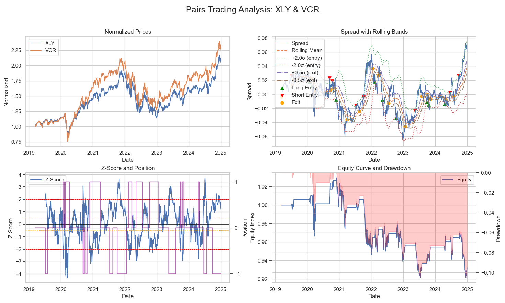

# gains-and-losses
Algorithmic trading, blackjack, poker, game theory, all in one place. 

I watch YouTube videos and read books about these things instead of doing homework; this is my documentation of research in the above fields, code implentation to explore more.

Day Trading 
- [price action notes](quanta/notes/day_trading_price_action.md) — break of structure (BOS), change of character (ChoCH), liquidity sweeps, order blocks, fair value gaps/imbalances, inverse FVGs, balanced price action

Algorithmic / Quantitative Trading
- statistical arbitrage & pairs trading

Blackjack
- basic strategy
- Monte Carlo simulations
- card counting (hi/lo)
- betting patterns
- deviations

Poker
- pot odds
- betting patterns
